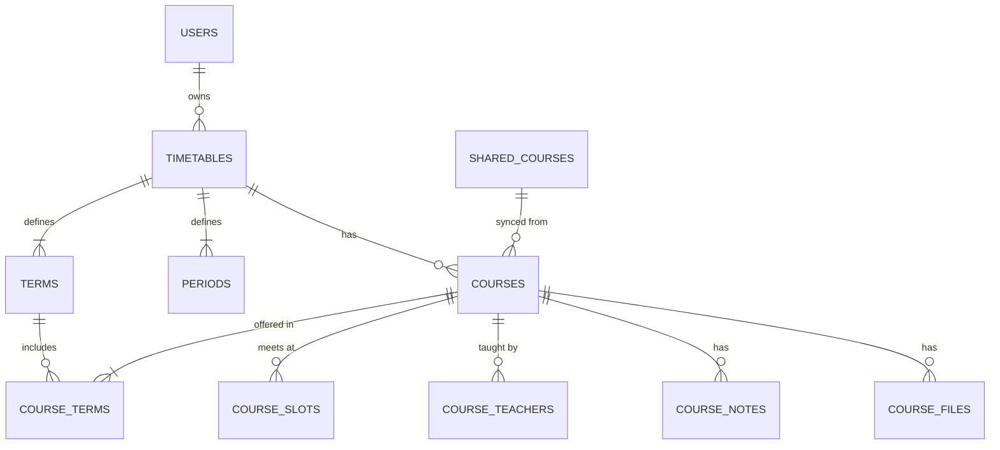
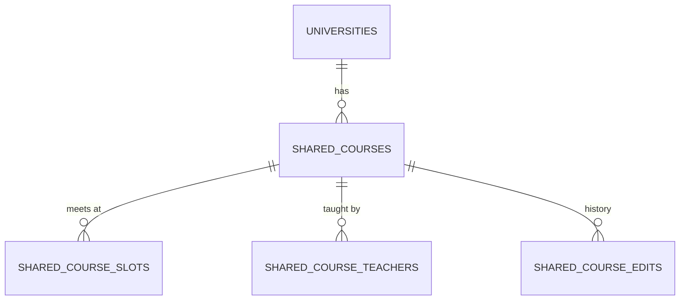
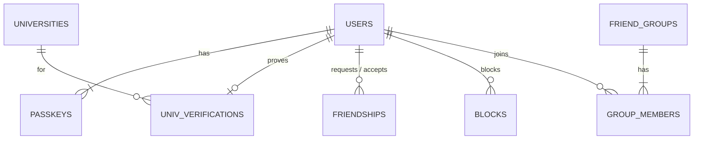

# データ構造

D1（SQLite）に置いている。定義は `src/lib/server/db/schema.ts`、マイグレーションは `drizzle/`。

## 時間割

| テーブル | 主な列 | メモ |
|---|---|---|
| `TIMETABLES` | user_id, university_id, year, name, archived | 年度ごとに1つ（user_id と year で一意）。新しい年度を作ると古いものは `archived` になる。はじめの設定で作るか、年度が変わってはじめて開いたときに、大学のひな形（なければ前の年度の形を1年ずらしたもの）から作る |
| `TERMS` | timetable_id, name, group_name, start_date, end_date, sort_order | 前期・Q1 など。`group_name` はタブの上に出すまとまり（Q1・Q2 なら前期）。本人が変えられる。変えて消えた学期の授業は、日付が重なる学期（なければ1年の中で同じ位置の学期）に移す |
| `PERIODS` | timetable_id, number, start_time, end_time | 0限から。変えても授業の `period_number` はそのまま残す |
| `COURSES` | timetable_id, shared_course_id, sync_mode, title, color, delivery, intensive_from, intensive_to | `sync_mode` は `synced`（みんなと同期）か `personal`（自分だけ）。`delivery` は枠のない授業の形（`ondemand` か `intensive`）で、集中講義は期間も持てる。`shared_course_id` は外部キーにしていない（あとから足すとテーブルを作り直すことになるうえ、共有授業は消さないので） |
| `COURSE_TERMS` | course_id, term_id | 授業と学期は多対多。「Q1とQ2」「通年」を表せる |
| `COURSE_SLOTS` | course_id, weekday, period_number, span, week_pattern, room | 週2回なら2行。`span` は連続コマ数、`week_pattern` は毎週（`every`）・奇数週（`odd`）・偶数週（`even`）。週は学期の始まる週を1週目として数える。**教室は枠ごと**。枠が0行の授業はオンデマンド・集中講義 |
| `COURSE_TEACHERS` | course_id, name, sort_order | 先生は何人でも |
| `COURSE_NOTES` | course_id, kind, date, body, due, done | `kind` は `memo`・`task`・`cancel`。`date` はメモの日付か休講の日、`due` は課題の締切。授業につながるので、どの枠から開いても同じ |
| `COURSE_FILES` | course_id, storage_key, name, mime, size | 資料。実体はシンレンタルサーバー（`relay/files.php`）に `storage_key` の名前で置く。本人しか見られない |

同期している授業（`synced`）は、授業名・先生・曜日時限・教室・隔週・授業の形を `SHARED_COURSES` から読む。色・取る学期・メモ・資料・課題は本人のもの。

- 保存するときは、自分の行（`COURSES` など）にも必ず同じ内容を書く。あとで「自分だけで使う」に切り替えても、最後に見ていた内容が残る
- 同期中に保存すると、中身が変わったときだけ共有授業を更新し、`version` を1つ上げて `SHARED_COURSE_EDITS` に前後の値を残す
- 編集画面は開いたときの `version` を送る。保存するときにもう進んでいたら、だれかの変更を見ないまま上書きしないように、保存を止めて読み込み直してもらう。更新そのものも `version` が一致するときだけ行い、ずれていたら batch ごと失敗させる（D1 の batch は途中で失敗すると全部取り消される）
- 「自分だけで使う」から同期に戻すと、フォームは共有授業の値に戻る。自分用に変えた内容で共有データを上書きしないため
- 自分で入力した授業も、初期値は「みんなと同期する」。同じ大学の人が「授業をさがす」で選べるようになる

## 共有授業データ

| テーブル | 主な列 | メモ |
|---|---|---|
| `UNIVERSITIES` | name, email_domains, term_preset, period_preset, source | `name` は一意。`source` は `preset`（ひな形あり）か `user`（だれかが入力した名前。ひな形なし）。`email_domains` は在籍確認に使い、完全一致か `.` 区切りのサブドメインだけで判定する（単純な末尾一致は使わない）。学期の日付はある1年度のもので、その年度の時間割にだけコピーする（毎年マイグレーションで更新する） |
| `SHARED_COURSES` | university_id, year, code, title, terms, delivery, intensive_from, intensive_to, source, version | `code` はシラバスの授業コード。`source` は `syllabus` か `user`。`terms` は開講する学期の名前（Q3 など）で、登録したときの値のまま変えない（Q3 だけ取る人の保存で「Q3・Q4 の授業」が書き換わらないように）。「授業をさがす」で学期をしぼるのに使う |
| `SHARED_COURSE_SLOTS` | shared_course_id, weekday, period_number, span, week_pattern, room | シラバスに教室がない大学は、みんなの登録で埋める |
| `SHARED_COURSE_TEACHERS` | shared_course_id, name, sort_order | |
| `CLASS_REMINDERS` | user_id, minutes | 授業が始まる何分前に通知するか。1人3つまで、選べるのは5・10・15・30・45・60・90・120。主キーは (user_id, minutes)。1分ごとの Cron が読む |
| `SHARED_COURSE_EDITS` | shared_course_id, user_id, diff, created_at | 変更履歴（`diff` は前後の値）。「みんなの授業データ」から前の内容に戻せる。戻すことも1つの変更として残る |

共有データを直せる（元に戻せる）のは、その授業を自分の時間割に「みんなと同期」で入れていて、その大学の在籍確認が切れていない人（と運営）。ほかの人も授業の追加・そのまま使う・報告はできる。直せない人が同期中の授業を直すと、その授業は共有とのつながりを残したまま「自分だけで使う」になる（編集画面で先に伝える）。変更はすべて `SHARED_COURSE_EDITS` に残るので、荒らされても戻せる。

「授業をさがす」は、同じ大学・年度の共有授業から、タップした曜日・時限にあって選んでいる学期に開講するものを出す（名前で検索したときは学期でしぼらない）。自分の時間割にもう入れた授業は出さない。D1 は1つのクエリに値を100個までしか渡せないので、候補は60件までにしている。共有授業を id でまとめて読むときも90個ずつに分ける。

## アカウント・友だち

| テーブル | 主な列 | メモ |
|---|---|---|
| `USERS` | email, nickname, google_sub, icon, theme, days_shown, university_id, setup_at, friend_code, role, verify_prompt_stage | `icon` は `{"color": "ai", "text": "は"}`（なければニックネームの1文字目と、id から決めた色）。`university_id` は本人の大学で、新しい年度の時間割のひな形に使う（外部キーにはしていない。足すと users を作り直すことになるため）。`setup_at` ははじめの設定を終えた時刻。`friend_code` は友だちリンクの10文字（初めて要るときに作る。作り直せる）。`role` は `admin` だけ。`verify_prompt_stage` は在籍確認をすすめる画面をどこまで出したか（null=まだ。99=一度も確認していない人に出した、30/14/7=期限の何日前まで、0=切れたあとまで。確認すると null に戻る。`src/lib/verify-prompt.ts`）。写真のアイコンは `icon.photo`（設定した時刻）があるときだけ |
| `USER_PHOTOS` | user_id, jpeg, updated_at | アイコンの写真。端末で作った256ピクセル四方の JPEG を base64 で持つ（毎回読む users とは分ける）。退会で消える |
| `PASSKEYS` | id, user_id, public_key, counter, name | 1人で複数持てる。`name` は作ったときに AAGUID（パスワードマネージャー）か端末から付け、本人が変えられる |
| `UNIV_VERIFICATIONS` | user_id, university_id, email, verified_at, expires_at | 1人1件（user_id が主キー）。`email` は一意で、同じアドレスで別のアカウントを確認すると前のアカウントから外れる。毎年5月1日に切れる（4月に確認し直す） |
| `VERIFY_TOKENS` | id, user_id, university_id, email, expires_at | 在籍確認のメールのリンク。`id` はトークンの SHA-256。1日で切れ、1回だけ使える。1人3件まで |
| `FRIENDSHIPS` | requester_id, addressee_id, pair, status | `pair` は2人の id を並べたもので一意（どちらから申請しても1行）。`status` は `pending` か `accepted`。承認されるまで時間割は見えない |
| `BLOCKS` | blocker_id, blocked_id | 友だち・グループより優先。ブロックすると友だちの行も消す |
| `FRIEND_GROUPS` | name, owner_id, invite_code | サークル・ゼミなど（`GROUPS` は SQLite のキーワードと重なるので避けた）。`owner_id` の人が名前の変更などをできる。抜けると、いちばん前からいるメンバーに引き継ぐ |
| `GROUP_MEMBERS` | group_id, user_id, share_timetable | `share_timetable` はそのグループに時間割を見せるか（初期値は見せる） |

時間割が見られるのは、本人、承認した友だち、同じグループで `share_timetable` を選んだメンバーだけ。どちらかがブロックしていたら見えない（`src/lib/server/friends.ts` の `visibleUserIds`）。

## 運営まわり

| テーブル | 主な列 | メモ |
|---|---|---|
| `REPORTS` | reporter_id, target_type, target_id, reason, detail, status | `target_type` は `user`・`group`・`shared_course`。理由は種類ごとに決まった選択肢から。`/admin` で対応済み（`closed`）にする |
| `IMPORT_JOBS` | user_id, timetable_id, status, image, provider, result, error, attempts, retry_at, finished_at, closed_at | スクショ読み取りの順番待ちの正本。`status` は `queued`・`processing`・`retry`（翌日に再挑戦）・`done`・`failed`。`image` は切り抜いた画像（JPEG の data URL、1.4MB まで）で、読み終わるか、あきらめた時点で消す。`closed_at` は結果を保存したか閉じた時刻 |
| `FEEDBACK` | user_id, kind, body, env, status | 不具合・要望。`env` は送る人が見て付けることを選んだ端末の情報だけ |

## 退会したとき

| データ | 扱い |
|---|---|
| アカウント、パスキー、在籍確認 | 消す |
| 時間割、授業、メモ・資料・課題、シンに置いた資料のファイル | 消す。ファイルは D1 の行より先に、1回に40件ずつ消す（無料プランの外部へのリクエストの上限のため、残りがあると画面がもう一度送る）。消せなかったら退会もしない |
| 友だち、ブロック、グループの所属 | 消す。自分が持ち主のグループは、いちばん前からいるメンバーに引き継ぐ。ほかにいなければ消す |
| スクショ読み取りの記録 | 消す |
| 通報・フィードバック | 送った人の情報を外して残す |
| 共有授業データ（`SHARED_COURSES`） | ほかの人も使っているので**消さない** |
| 共有授業データの変更履歴（`SHARED_COURSE_EDITS`） | `user_id` を外して匿名にして残す |

## 重ね表示の判定

1. 自分は選んでいる学期。ほかの人は、見ている日付（その学期の今日。学期の外ならその学期の初日）を含む学期。学期に日付がない人は、同じ名前の学期
2. 授業の枠をその人の時限の時刻に直し、見ている人の時限と1分でも重なればその時限を埋める
3. 同じ `shared_course_id` の授業は1つにまとめる（同期していなくても、共有授業から選んだ授業はつながっている）
4. 共有データにつながっていない授業だけ、同じ大学の中で授業名（全角・空白をそろえたもの）が同じものをまとめる

計算は `src/lib/overlay.ts`（テストあり）。
