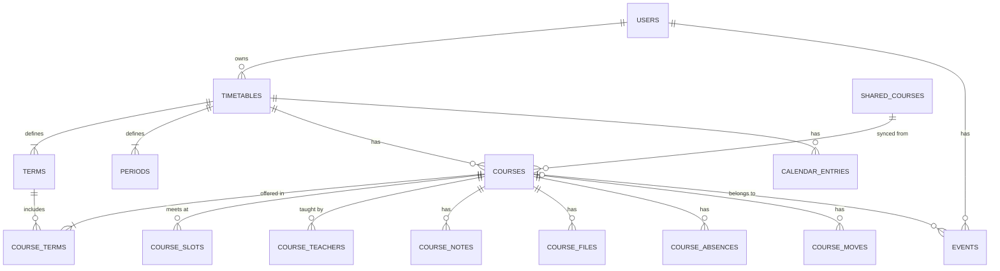
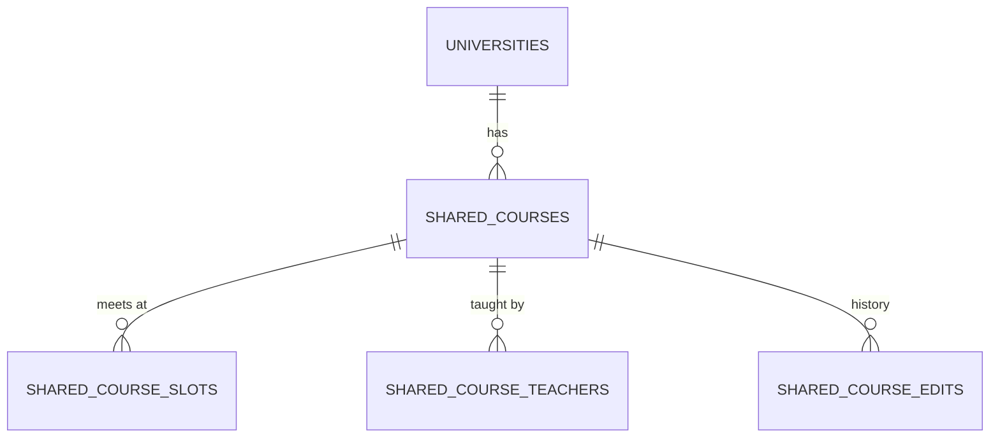
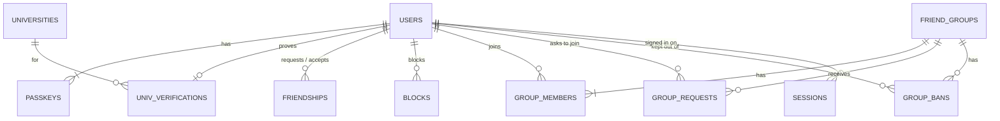

# データ構造

D1（SQLite）に置いている。定義は `src/lib/server/db/schema.ts`、マイグレーションは `drizzle/`。

D1 のマイグレーションは自動では当たらない（[README](../README.md) の「本番に出すとき」）。`0021_sessions_groups_contact`（ログイン中の端末、グループの承認・退出、お問い合わせ、メモの並び順、スクショ読み取りの同意）と `0022_plans`（予定のイベント、欠席と単位、休講の共有、運営の警告・利用停止・毎日の数字）は、本番に手で当てる。

## 時間割

| テーブル | 主な列 | メモ |
|---|---|---|
| `TIMETABLES` | user_id, university_id, year, name, archived | 年度ごとに1つ（user_id と year で一意）。新しい年度を作ると古いものは `archived` になる。はじめの設定で作るか、年度が変わってはじめて開いたときに、大学のひな形（なければ前の年度の形を1年ずらしたもの）から作る |
| `TERMS` | timetable_id, name, group_name, start_date, end_date, sort_order | 前期・Q1 など。`group_name` はタブの上に出すまとまり（Q1・Q2 なら前期）。本人が変えられる。変えて消えた学期の授業は、日付が重なる学期（なければ1年の中で同じ位置の学期）に移す |
| `PERIODS` | timetable_id, number, start_time, end_time | 0限から。変えても授業の `period_number` はそのまま残す |
| `COURSES` | timetable_id, shared_course_id, sync_mode, title, color, delivery, intensive_from, intensive_to, credits, absence_limit, shared_seen_at | `credits` は単位数（0.5きざみ）で、同期中は共有授業の値を読む。`absence_limit` は欠席できる回数で、本人のもの。どちらも空なら、大学の決まり（`src/lib/courses.ts` の `creditsOf`・`absenceLimitOf`）があればその値を使う。`sync_mode` は `synced`（みんなと同期）か `personal`（自分だけ）。`delivery` は枠のない授業の形（`ondemand` か `intensive`）で、集中講義は期間も持てる。`shared_course_id` は外部キーにしていない（あとから足すとテーブルを作り直すことになるうえ、共有授業は消さないので） |
| `COURSE_TERMS` | course_id, term_id | 授業と学期は多対多。「Q1とQ2」「通年」を表せる |
| `COURSE_SLOTS` | course_id, weekday, period_number, span, week_pattern, room | 週2回なら2行。`span` は連続コマ数、`week_pattern` は毎週（`every`）・奇数週（`odd`）・偶数週（`even`）。週は学期の始まる週を1週目として数える。**教室は枠ごと**。枠が0行の授業はオンデマンド・集中講義 |
| `COURSE_TEACHERS` | course_id, name, sort_order | 先生は何人でも |
| `COURSE_NOTES` | course_id, kind, date, body, due, due_time, submit_to, steps, series_id, done, sort_order | `kind` は `memo`・`task`・`cancel`。`date` はメモの日付か休講の日、`due` は課題の締切。授業につながるので、どの枠から開いても同じ。`sort_order` はメモを手で並べたときの順（小さいほど上）で、メモだけが使う。並べていなければ null で、日付の新しい順・同じ日は足した順の新しい方が上（`src/lib/notes.ts` の `orderMemos`）。並べたあとに足したメモは、いちばん上の数より小さい値を付けて先頭に置く。書いた中身（メモ・課題の名前と締切・休講の日とメモ）は直せて、直しても種類・足した日・順は変わらない。課題は締切の時刻（`due_time`、日付があるときだけ）、提出先（`submit_to`、文字でも URL でもよく、`https://` で始まるものだけリンクにする）、チェック項目（`steps`、`[{text, done}]` の JSON、100個まで）を持てる。毎週くり返す課題は、締切の日から1週ごとに最大20件を一度に作り、同じ `series_id` を付ける（消すとき「これ以降ぜんぶ」で使う） |
| `COURSE_FILES` | course_id, storage_key, name, mime, size | 資料。実体はシンレンタルサーバー（`relay/files.php`）に `storage_key` の名前で置く。本人しか見られない |
| `COURSE_MOVES` | course_id, from_date, to_date, period, span, room | 授業ごとの振替。`from_date` はその授業がない日（休講と同じ扱い）、`to_date` の `period` から `span` コマに1回だけある。本人のもので、友だちや画像の書き出しには出さない |
| `CALENDAR_ENTRIES` | timetable_id, kind, label, start_date, end_date | 時間割の日程。`kind` は `off`（休みの日。授業を出さず、授業前の通知も送らない）か `exam`（試験期間。印を出すだけ）。1行で数日をまとめられる。祝日は `src/lib/holidays.ts` で計算して入れる（外のサービスには取りに行かない）。大学の日程は `universities.calendar_preset` から、使う人が選んだときだけ写す |
| `COURSE_ABSENCES` | course_id, date | 欠席した日。1つの授業で1日1行（course_id と date で一意）。本人のもので、共有しない |
| `EVENTS` | user_id, title, date, start_time, end_time, place, memo, course_id, exam, scope, bring | 予定のイベント。`start_time` が null なら終日。`course_id` は授業のイベント（試験など）で、授業を消すと null になり、イベントは残る。課題は `COURSE_NOTES` のままで、予定のタブが両方を並べる。`exam` が試験で、`scope`（範囲）と `bring`（持ち物）を持てる。予定のタブの「試験」で近い順に並ぶ |

同期している授業（`synced`）は、授業名・先生・曜日時限・教室・隔週・授業の形を `SHARED_COURSES` から読む。単位数も共有授業から読む。色・取る学期・メモ・資料・課題・休講・欠席・欠席できる回数は本人のもの。休講は、同期しているほかの人に人数だけ見せる（[運営まわり](#運営まわり)の `CANCELLATION_HIDES`、`src/lib/server/cancellations.ts`）。

- 保存するときは、自分の行（`COURSES` など）にも必ず同じ内容を書く。あとで「自分だけで使う」に切り替えても、最後に見ていた内容が残る
- 同期中に保存すると、中身が変わったときだけ共有授業を更新し、`version` を1つ上げて `SHARED_COURSE_EDITS` に前後の値を残す
- 編集画面は開いたときの `version` を送る。保存するときにもう進んでいたら、だれかの変更を見ないまま上書きしないように、保存を止めて読み込み直してもらう。更新そのものも `version` が一致するときだけ行い、ずれていたら batch ごと失敗させる（D1 の batch は途中で失敗すると全部取り消される）
- 「自分だけで使う」から同期に戻すと、フォームは共有授業の値に戻る。自分用に変えた内容で共有データを上書きしないため
- 自分で入力した授業も、初期値は「みんなと同期する」。同じ大学の人が「授業をさがす」で選べるようになる
- `shared_seen_at` は、その人が共有授業の変更を最後に見た時刻。保存したときと「確認した」を押したときに入る。これより後のほかの人の変更は、詳細に前後の値を出し、時間割のマスに印を付ける（`src/lib/server/courses.ts` の `unseenChanges`）。「自分用に切り替える」は、見ていなかった最初の変更の前の値で「自分だけで使う」にする。変更は通知（種類 `sharedChange`）でも知らせる

## 共有授業データ

| テーブル | 主な列 | メモ |
|---|---|---|
| `UNIVERSITIES` | name, email_domains, term_preset, period_preset, calendar_preset, source, created_by | `name` は一意。`source` は `preset`（ひな形あり）か `user`（だれかが入力した名前。ひな形なし）。`created_by` は `user` の大学を入力した人（運営の画面に出す。退会すると空になる。0027 より前の大学は空）。入力候補に出るのは `preset` と、`users.university_id` で選んでいる人が3人以上（`SUGGEST_MIN_USERS`）の大学だけ。`user` の名前は、入力した本人はそのまま使えるが、3人に届くまでほかの人の候補には出ない（`/admin` の「利用者が作った大学」で人数を見られる）。`email_domains` は在籍確認に使い、完全一致か `.` 区切りのサブドメインだけで判定する（単純な末尾一致は使わない）。学期の日付はある1年度のもので、その年度の時間割にだけコピーする（毎年マイグレーションで更新する）。`calendar_preset` はある1年度の休み・試験期間（`{year, source, checkedAt, entries}`、`source` は出典の URL、`checkedAt` は確認した日）。学期のひな形と同じくマイグレーションで入れる |
| `SHARED_COURSES` | university_id, year, code, title, terms, delivery, intensive_from, intensive_to, credits, source, version | `credits` は単位数で、同期しているみんなで同じ値。`code` はシラバスの授業コード。`source` は `syllabus` か `user`。`terms` は開講する学期の名前（Q3 など）で、登録したときの値のまま変えない（Q3 だけ取る人の保存で「Q3・Q4 の授業」が書き換わらないように）。「授業をさがす」で学期をしぼるのに使う |
| `SHARED_COURSE_SLOTS` | shared_course_id, weekday, period_number, span, week_pattern, room | シラバスに教室がない大学は、みんなの登録で埋める |
| `SHARED_COURSE_TEACHERS` | shared_course_id, name, sort_order | |
| `CLASS_REMINDERS` | user_id, minutes | 授業が始まる何分前に通知するか。1人3つまで、選べるのは5・10・15・30・45・60・90・120。主キーは (user_id, minutes)。1分ごとの Cron が読む |
| `SHARED_COURSE_EDITS` | shared_course_id, user_id, diff, created_at | 変更履歴（`diff` は前後の値）。「みんなの授業データ」から前の内容に戻せる。戻すことも1つの変更として残る |

共有データを直せる（元に戻せる）のは、その授業を自分の時間割に「みんなと同期」で入れていて、その大学の在籍確認が切れていない人（と運営）。ほかの人も授業の追加・そのまま使う・報告はできる。直せない人が同期中の授業を直すと、その授業は共有とのつながりを残したまま「自分だけで使う」になる（編集画面で先に伝える）。変更はすべて `SHARED_COURSE_EDITS` に残るので、荒らされても戻せる。

「授業をさがす」は、同じ大学・年度の共有授業から、タップした曜日・時限にあって選んでいる学期に開講するものを出す（名前で検索したときは学期でしぼらない）。自分の時間割にもう入れた授業は出さない。D1 は1つのクエリに値を100個までしか渡せないので、候補は60件までにしている。共有授業を id でまとめて読むときも90個ずつに分ける。

## アカウント・友だち

| テーブル | 主な列 | メモ |
|---|---|---|
| `USERS` | email, nickname, google_sub, icon, theme, days_shown, university_id, setup_at, friend_code, role, verify_prompt_stage, import_consent_at, suspended_at, share_cancellations | `suspended_at` は運営が利用を止めた時刻（null ならふつう）。`share_cancellations` は自分の休講を同じ授業の人の数に入れるか（初期はオン）。`icon` は `{"color": "ai", "text": "は"}`（なければニックネームの1文字目と、id から決めた色）。`university_id` は本人の大学で、新しい年度の時間割のひな形に使う（外部キーにはしていない。足すと users を作り直すことになるため）。`setup_at` ははじめの設定を終えた時刻。`friend_code` は友だちリンクの10文字（初めて要るときに作る。作り直せる）。`role` は `admin` だけ。`import_consent_at` はスクショ読み取りで、画像を外部のサービスへ送ることを含む注意書きを確認して、はじめて送った時刻。`verify_prompt_stage` は在籍確認をすすめる画面をどこまで出したか（null=まだ。99=一度も確認していない人に出した、30/14/7=期限の何日前まで、0=切れたあとまで。確認すると null に戻る。`src/lib/verify-prompt.ts`）。写真のアイコンは `icon.photo`（設定した時刻）があるときだけ |
| `USER_PHOTOS` | user_id, jpeg, updated_at | アイコンの写真。端末で作った256ピクセル四方の JPEG を base64 で持つ（毎回読む users とは分ける）。退会で消える |
| `PASSKEYS` | id, user_id, public_key, counter, name | 1人で複数持てる。`name` は作ったときに AAGUID（パスワードマネージャー）か端末から付け、本人が変えられる |
| `UNIV_VERIFICATIONS` | user_id, university_id, email, verified_at, expires_at | 1人1件（user_id が主キー）。`email` は一意で、確認は別のアカウントに移らない：ほかのアカウントの行にあるアドレスでは確認できない（リンクを開いたときに断る）。期限が切れても行は残るので、そのアドレスは退会するまで、そのアカウントのものとして残る。毎年5月1日に切れる（4月に確認し直す） |
| `VERIFY_TOKENS` | id, user_id, university_id, email, expires_at | 在籍確認のメールのリンク。`id` はトークンの SHA-256。1日で切れ、1回だけ使える。1人3件まで。同じアドレスには、だれが申し込んでも60秒あけないと作らない。リンクを使えるのは、申し込んだアカウントでログインしているときだけ |
| `FRIENDSHIPS` | requester_id, addressee_id, pair, status | `pair` は2人の id を並べたもので一意（どちらから申請しても1行）。`status` は `pending` か `accepted`。承認されるまで時間割は見えない |
| `BLOCKS` | blocker_id, blocked_id | 友だち・グループより優先。ブロックすると友だちの行も消す |
| `FRIEND_GROUPS` | name, owner_id, invite_code, approval | サークル・ゼミなど（`GROUPS` は SQLite のキーワードと重なるので避けた）。`owner_id` の人が名前の変更などをできる。抜けると、いちばん前からいるメンバーに引き継ぐ。`approval` が真だと、招待リンクを開いた人は参加できず、申請になる |
| `GROUP_MEMBERS` | group_id, user_id, share_timetable | `share_timetable` はそのグループに時間割を見せるか（初期値は見せる） |
| `GROUP_REQUESTS` | group_id, user_id, share_timetable | 承認制のグループへの参加の申請。主キーは (group_id, user_id)。申請のときに選んだ `share_timetable` を持っておき、承認されたら `GROUP_MEMBERS` にそのまま入れる。承認・断る・本人の取り消しで消える |
| `GROUP_BANS` | group_id, user_id | 作った人が「退出させた」人。主キーは (group_id, user_id)。ここにいる人は招待リンクから参加も申請もできない。作った人が「参加できるようにする」で消す。退出させると、メンバーの行と申請も消える |

時間割が見られるのは、本人、承認した友だち、同じグループで `share_timetable` を選んだメンバーだけ。どちらかがブロックしていたら見えない（`src/lib/server/friends.ts` の `visibleUserIds`）。

## ログインの記録・通知・回数

| テーブル | 主な列 | メモ |
|---|---|---|
| `SESSIONS` | id, user_id, expires_at, created_at, last_used_at, user_agent, authed_at | ログインしている端末ごとに1行。`id` は Cookie の値の SHA-256。有効は30日で、残りが15日を切ると延ばす。`last_used_at` は最後に使った時刻（更新は1時間に1回まで）、`user_agent` は「iPhone・Safari」のような端末の名前を出すために持つ（400文字まで）。`authed_at` はその端末で最後にログインした時刻で、退会と運営の画面が「もう一度ログイン」を求めるか決めるのに使う。この列を持つ前のログインは null で、「不明な端末」と出す |
| `PUSH_SUBSCRIPTIONS` | user_id, endpoint, p256dh, auth, session_id, last_ok_at, last_failed_at | 通知を受け取る端末。`session_id` は通知をオンにしたときのログイン（外部キーにはしていない。前からある行は null）。そのログインが終わる（ログアウト、「ログイン中の端末」から外す）と、この行も消える。`last_ok_at`・`last_failed_at` は最後に届けた時刻と届けられなかった時刻で、「通知 → 届かないときは」に出す |
| `UNDO_ITEMS` | user_id, kind, row, expires_at | 消したメモ・課題（`note`）と予定（`event`）を、「元に戻す」のために10分だけ行ごと持っておく。古いものは毎日の Cron で消す |
| `RATE_COUNTS` | key, n, expires_at | アプリ全体で数える回数。今はメールの送信数だけ（キーは `mail:h:<時間>` と `mail:d:<日本時間の日>`）。`expires_at` を過ぎた行は毎日の Cron で消す |

## 運営まわり

| テーブル | 主な列 | メモ |
|---|---|---|
| `REPORTS` | reporter_id, target_type, target_id, reason, detail, status | `target_type` は `user`・`group`・`shared_course`・`shared_cancel`。`shared_cancel` は休講の共有への報告で、`target_id` は `<共有授業のid>\|<日付>`（1人1日1件）。理由は種類ごとに決まった選択肢から。`/admin/reports` で対応済み（`closed`）にする |
| `CANCELLATION_HIDES` | shared_course_id, date | 運営が消した休講の共有。この授業のこの日は、だれの休講も数えない |
| `WARNINGS` | user_id, body, sent_by, acknowledged_at | 運営からの警告。`acknowledged_at` が null のあいだ、本人の画面いっぱいに出る（古いものから1つずつ）。送った運営が退会すると `sent_by` だけ null になる |
| `DAILY_STATS` | date, users, active_day, active_week, verified | 毎日の Cron が1日1行書く（日本時間の日付）。開いた人の数はあとから数え直せないので、`/admin/stats` のグラフのために残す |
| `IMPORT_JOBS` | user_id, timetable_id, status, image, provider, result, error, attempts, retry_at, finished_at, closed_at | スクショ読み取りの順番待ちの正本。`status` は `queued`・`processing`・`retry`（翌日に再挑戦）・`done`・`failed`。`image` は切り抜いた画像（JPEG の data URL、1.4MB まで）で、読み終わるか、あきらめた時点で消す。`closed_at` は結果を保存したか閉じた時刻 |
| `FEEDBACK` | user_id, kind, body, env, status, reply, replied_at | 不具合・要望。`env` は送る人が見て付けることを選んだ端末の情報だけ。`status` は `open`（受付）・`doing`（対応中）・`closed`（対応済み）・`declined`（見送り）。`reply` は運営からのひと言で、送った人が「送ったもの」で見られる |
| `STATUS_NOTES` | level, body, created_at, resolved_at | `/status` とアプリの上の帯に出す運営のお知らせ。`level` は `trouble`（障害）か `info`。「解決」にすると `resolved_at` が入り、1週間は「解決したこと」に出る |
| `METRICS` | hour, name, n, total_ms | 品質の数字。1時間ごと（UTC）に、件数と合計時間だけを数える（エラー、通知の成否、読み取りの成否と時間、メールの失敗）。だれのものか、どのページかは持たない。30日で消す |
| `CONTACT_MESSAGES` | name, email, body, status | お問い合わせ（`/contact`）。ログインしていない人も送れるので、`users` とはつなげない。`status` は `open` か `closed`（`/admin` で対応済み）。直近24時間で、全体で50件、1つのアドレスで3件まで |

## 退会したとき

| データ | 扱い |
|---|---|
| アカウント、パスキー、在籍確認、ログインの記録（`SESSIONS`）、通知の宛先 | 消す |
| 時間割、授業、メモ・資料・課題・休講・欠席、イベント、シンに置いた資料のファイル | 消す。ファイルは D1 の行より先に、1回に40件ずつ消す（無料プランの外部へのリクエストの上限のため、残りがあると画面がもう一度送る）。消せなかったら退会もしない |
| 友だち、ブロック、グループの所属、参加の申請、退出させられた記録 | 消す。自分が持ち主のグループは、いちばん前からいるメンバーに引き継ぐ。ほかにいなければ消す |
| スクショ読み取りの記録 | 消す |
| 通報・フィードバック | 送った人の情報を外して残す |
| 受けた警告 | 消す。自分が運営として送った警告は、送った人を外して残す |
| お問い合わせ（`CONTACT_MESSAGES`） | アカウントとつながっていないので、退会しても残る。消してほしいときはお問い合わせで頼んでもらう |
| 共有授業データ（`SHARED_COURSES`） | ほかの人も使っているので消さない |
| 共有授業データの変更履歴（`SHARED_COURSE_EDITS`） | `user_id` を外して匿名にして残す |

## 重ね表示の判定

1. 自分は選んでいる学期。ほかの人は、見ている日付（その学期の今日。学期の外ならその学期の初日）を含む学期。学期に日付がない人は、同じ名前の学期
2. 授業の枠をその人の時限の時刻に直し、見ている人の時限と1分でも重なればその時限を埋める
3. 同じ `shared_course_id` の授業は1つにまとめる（同期していなくても、共有授業から選んだ授業はつながっている）
4. 共有データにつながっていない授業だけ、同じ大学の中で授業名（全角・空白をそろえたもの）が同じものをまとめる

計算は `src/lib/overlay.ts`（テストあり）。
