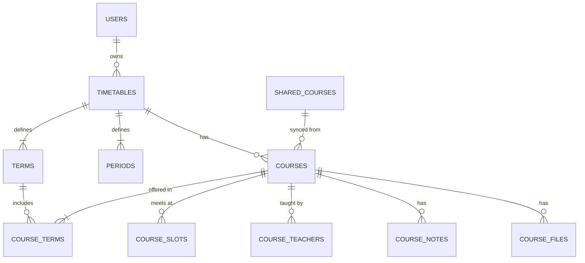
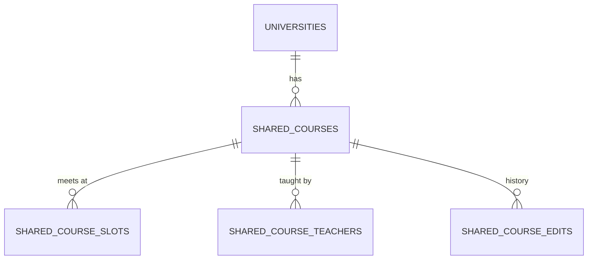
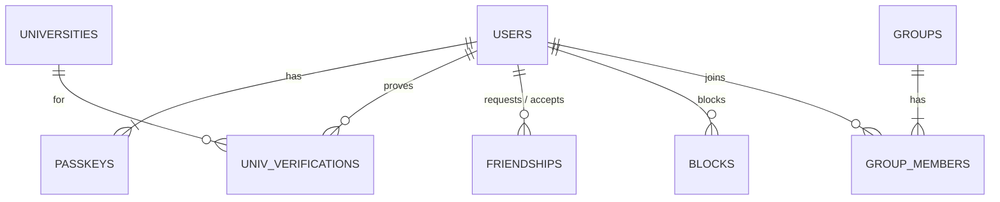

# データ構造

D1（SQLite）に置く前提の叩き台。

## 時間割

| テーブル | 主な列 | メモ |
|---|---|---|
| `TIMETABLES` | user_id, university_id, year, name, archived | 年度ごとに1つ。古いものは `archived` にして残す |
| `TERMS` | timetable_id, name, start_date, end_date, sort_order | 前期・Q1 など。大学のひな形からコピーして、本人が変えられる |
| `PERIODS` | timetable_id, number, start_time, end_time | 0限や7限もあり得る |
| `COURSES` | timetable_id, shared_course_id, sync_mode, title, color | `sync_mode` は `synced`（みんなと同期）か `personal`（自分だけ） |
| `COURSE_TERMS` | course_id, term_id | 授業と学期は多対多。「Q1とQ2」「通年」を表せる |
| `COURSE_SLOTS` | course_id, weekday, period_number, span, week_pattern, room | 週2回なら2行。`span` は連続コマ数、`week_pattern` は毎週・奇数週・偶数週。**教室は枠ごと**。枠が0行の授業はオンデマンド・集中講義 |
| `COURSE_TEACHERS` | course_id, name, sort_order | 先生は何人でも |
| `COURSE_NOTES` | course_id, kind, date, body, due, done | `kind` はメモ・課題・休講。授業につながるので、どの枠から開いても同じ |
| `COURSE_FILES` | course_id, r2_key, name, size | 資料。実体は R2 |

同期している授業（`synced`）は、授業名・先生・曜日時限・教室を `SHARED_COURSES` から読む。色・メモ・資料・課題は本人のもの。

## 共有授業データ

| テーブル | 主な列 | メモ |
|---|---|---|
| `UNIVERSITIES` | name, email_domains, term_preset, period_preset | `email_domains` は完全一致か `.` 区切りのサブドメインだけで判定する（単純な末尾一致は使わない）。学期と時限のひな形を持つ |
| `SHARED_COURSES` | university_id, year, code, title, term_label, source, version | `code` はシラバスの授業コード。`source` は `syllabus` か `user` |
| `SHARED_COURSE_SLOTS` | shared_course_id, weekday, period_number, span, room | シラバスに教室がない大学は、みんなの登録で埋める |
| `SHARED_COURSE_TEACHERS` | shared_course_id, name, sort_order | |
| `SHARED_COURSE_EDITS` | shared_course_id, user_id, diff, created_at | 変更履歴。元に戻せるようにする |

共有データを直せるのは、その大学の在籍確認バッジを持つ人だけにする予定（細かいルールは未決）。

## アカウント・友だち

| テーブル | 主な列 | メモ |
|---|---|---|
| `USERS` | nickname, email, google_sub, icon, theme, days_shown, friend_code | |
| `PASSKEYS` | credential_id, user_id, public_key, sign_count, device_name | 1人で複数持てる |
| `UNIV_VERIFICATIONS` | user_id, university_id, email, verified_at, expires_at | 卒業後もメールが残る大学があるので、毎年4月に再確認 |
| `FRIENDSHIPS` | requester_id, addressee_id, status | 承認されるまで時間割は見えない |
| `BLOCKS` | blocker_id, blocked_id | グループより優先 |
| `GROUPS` | name, owner_id, invite_code | サークル・ゼミなど |
| `GROUP_MEMBERS` | group_id, user_id, role, share_timetable | `share_timetable` はそのグループに時間割を見せるか（初期値は見せる） |

## 運営まわり

| テーブル | 主な列 | メモ |
|---|---|---|
| `REPORTS` | reporter_id, target_type, target_id, reason, status | ユーザーや共有授業データへの通報 |
| `IMPORT_JOBS` | user_id, status, provider, r2_key, result, error, retry_at | スクショ読み取りの順番待ちの正本。「翌日に再挑戦」は Cron で Queues に積み直す。画像は読み取り後か3日後に消す |
| `FEEDBACK` | user_id, kind, body, env | 不具合・要望 |

## 退会したとき

| データ | 扱い |
|---|---|
| アカウント、パスキー、在籍確認 | 消す |
| 時間割、授業、メモ・資料・課題、R2 のファイル | 消す |
| 友だち、ブロック、グループの所属 | 消す。自分が持ち主のグループは、ほかのメンバーに引き継ぐか、いなければ消す |
| 通報・フィードバック | 送った人の情報を外して残す |
| 共有授業データ（`SHARED_COURSES`） | ほかの人も使っているので**消さない** |
| 共有授業データの変更履歴（`SHARED_COURSE_EDITS`） | `user_id` を外して匿名にして残す |

## 重ね表示の判定

1. 表示する日付から、それぞれの人の「今の学期」を決める
2. 授業の枠を時刻に直して、見ている人の時限の表に重ねる
3. 同じ `shared_course_id` の授業は1つにまとめる
4. 共有データにつながっていない授業だけ、同じ大学の中で授業名と曜日・時限が同じものをまとめる
